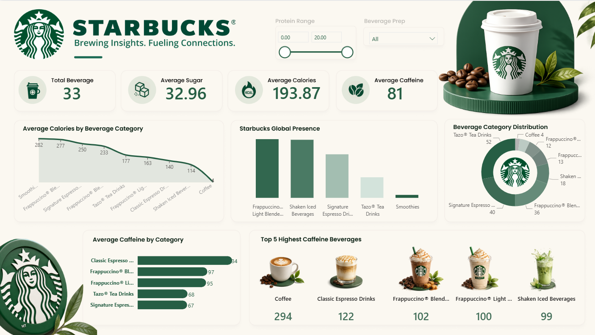

<p align="center">
  
</p>

<h1 align="center">☕ Starbucks Power BI Dashboard</h1>

<p align="center">
  Interactive Beverage Analytics Dashboard built using Power BI
</p>

---

## 📌 Project Overview

This project presents an interactive Starbucks Business Intelligence Dashboard developed using Power BI. The dashboard analyzes beverage nutritional information, caffeine levels, calorie distribution, and category-wise performance to generate meaningful business insights.

The objective of this project is to transform raw Starbucks beverage data into actionable insights using modern Business Intelligence techniques and interactive visualizations.

---

## 🛠️ Tools & Technologies

- Power BI
- Power Query
- DAX (Data Analysis Expressions)
- CSV Datasets
- Data Visualization
- Business Intelligence

---

## 📊 Dashboard Features

### KPI Metrics
- Total Beverages
- Average Sugar
- Average Calories
- Average Caffeine

### Interactive Analysis
- Protein Range Filter
- Beverage Preparation Filter

### Visualizations
- Average Calories by Beverage Category
- Beverage Category Distribution
- Average Caffeine by Beverage Category
- Top 5 Highest Caffeine Beverages
- Beverage Category Insights

---

## 📈 Key Business Insights

- Coffee beverages contain the highest average caffeine content.
- Frappuccino and Espresso categories contribute significantly to caffeine consumption.
- Different beverage categories exhibit distinct calorie and sugar patterns.
- Interactive slicers enable dynamic exploration of nutritional information.
- Dashboard supports data-driven decision-making through intuitive visualizations.

---

## 🖼️ Dashboard Preview



---

## 📂 Repository Structure

```text
Starbucks-PowerBI-Dashboard
│
├── README.md
├── Starbucks_Dashboard.pbix
├── dashboard-preview.png
├── starbucks-logo.png
├── starbucks.csv
└── directory.csv
```

---

## 🚀 Project Workflow

1. Data Collection
2. Data Cleaning using Power Query
3. Data Transformation
4. DAX Measure Creation
5. Dashboard Design
6. Interactive Visualization Development
7. Business Insight Generation

---

## 🎯 Skills Demonstrated

- Data Cleaning
- Data Transformation
- DAX Calculations
- KPI Development
- Dashboard Design
- Data Visualization
- Business Analytics
- Power BI Reporting

---

## 👨‍💻 Author

### Megharaj Shet

Aspiring Data Analyst | SQL | Excel | Power BI | Python | Data Visualization

🔗 LinkedIn: www.linkedin.com/in/megharaj-shet-774119317

🌟 If you found this project interesting, consider giving it a star!
